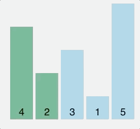
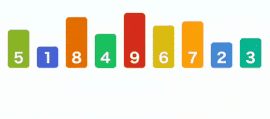

# Algorithms

## Bubble sort (Сортировка пузырьком)
Bubble sort compares each pair of elements in a list and swaps them if they are out of order until the list is sorted. Like insertion sort, bubble sort is a comparison algorithm and runs in O(n²) time, making it an inefficient algorithm for larger lists.

### Visual


### Code:
```javascript
function bubbleSort(arr) {
    var done = false;
  
    while(!done){
      done = true;
        for (var i = 0; i < arr.length - 1; i++) {
            if (arr[i] > arr[i+1]) {
                var temp = arr[i];
                arr[i] = arr[i+1];
                arr[i+1] = temp;
                done = false;
            }
        }
    }
    return arr;
}

bubbleSort([2, 6, 1, 9, 3, 8, 5, 4, 7]);
```

## Selection sort (Сортировка выбором)
A sort algorithm that repeatedly searches remaining items to find the least one and moves it to its final location. The run time is O(n²), where n is the number of elements. The number of swaps is O(n).

### Visual


### Code:
```javascript
function selectionSort(arr){
    for (let i = 0; i < arr.length; i++) {
        let min = i;
        for (let j = i + 1; j < arr.length; j++) {
            if (arr[min] > arr[j]) {
                min = j;
            }
        }
        if (min !== i) {
            let tmp = arr[i];
            arr[i] = arr[min];
            arr[min] = tmp;
        }
    }
    return arr;
}

selectionSort([1, 5, 6, 2, 3, 8, 4, 7, 9]);
```

## Insertion sort (Сортировка вставками)
Insertion sort is a simple sorting algorithm that works the way we sort playing cards in our hands. This sort is based on the idea that one element from the input elements is consumed in each iteration to find its correct position i.e, the position to which it belongs in a sorted array. Since is the first element has no other element to be compared with, it remains at its position. It is much less efficient on large lists than more advanced algorithms such as quicksort, heapsort, or merge sort.

### Visual


### Code:
```javascript
function insertionSort(arr){
  for (var i = 1; i < arr.length; i++){
    if (arr[i] < arr[0]){
      //move current element to the first position
      arr.unshift(arr.splice(i,1)[0]);
    }else if (arr[i] > arr[i-1]){
      //leave current element where it is
      continue;
    }else{
      //find where element should go
      for (var j = 1; j < i; j++){
        if (arr[i] > arr[j-1] && arr[i] < arr[j]){
          //move element
          arr.splice(j,0,arr.splice(i,1)[0]);
        }
      }
    }
  }
  return arr;
}

insertionSort([3, 0, 2, 5, 6, 4, 1]);
```

## Linear search (Линейный поиск)
In this algorithm, you can stop when the item is found and then there is no need to look further. In the best case, you could get lucky and the item you are looking at maybe at the first position in the array! But in the worst case, you would have to look at each and every item before you find the item at the last place or before you realize that the item is not in the array. The complexity therefore of the linear search is: O(n). If the element to be searched presides on the the first memory block then the complexity would be: O(1).

### Visual


### Code:
```javascript
function linearSearch(arr, item) {
  // Go through all the elements of arr to look for item.
  for (var i = 0; i < arr.length; i++) {
    if (arr[i] === item) { // Found it!
      return i;
    }
  }
  // Item not found in the array.
  return null;
}

linearSearch([1, 2, 3, 4, 5, 6, 7, 8, 9, 10, 11, 12, 13, 14, 15, 16, 17, 18, 19, 20], 13);
```

## Binary search (Бинарный поиск)
Binary search is an algorithm used to find a particular item in a **sorted list**. It’s essential for the list to be sorted beforehand or the algorithm won’t be applicable. If you’ve ever dealt with binary search trees, this concept of this algorithm is similar. In each step, the algorithm compares the input element x with the value of the middle element in array. If the values match, return the index of middle. Otherwise, if x is less than the middle element, then the algorithm recurs for left side of middle element, else recurs for right side of middle element.

### Visual


### Code:
```javascript
function binarySearch(arr, target) {
    let first = 0;
    let last = arr.length - 1;
    let position = -1;
    let found = false;
    let middle;

    while (found === false && first <= last) {
        middle = Math.floor((first + last) / 2);
        if (arr[middle] == target) {
            found = true;
            position = middle;
        }else if (arr[middle] > target){
            last = middle - 1;
        }else{
            first = middle + 1;
        }
    }
    return position;
}

binarySearch([1, 2, 3, 4, 5, 6, 7, 8, 9, 10, 11, 12, 13, 14, 15, 16, 17, 18, 19, 20], 13);
```

## Quicksort (Быстрая сортировка)

## Merge sort (Сортировка слиянием)

## Counting sort (Сортировка подсчётом)

## Heapsort (Пирамидальная сортировка)
